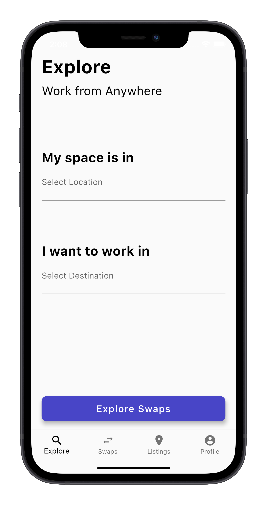
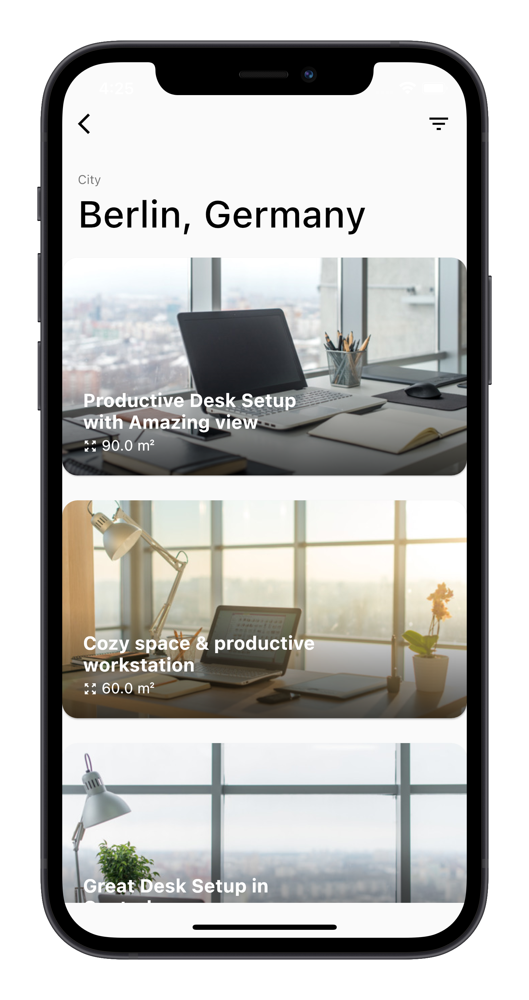

## Home Swap Mobile Application (iOS & Android)

In the App, users can find other users with whom they can exchange apartments for a limited period of time. In the app, you can list your apartment by providing information such as the number of possible workstations in the apartment and the location of the apartment. You can find other listings by specifying the location of your listing, such as the city and the desired destination. There is a search function in the app that displays listings from users interested in swapping with an apartment in your area. Users can send each other exchange requests in the app and accept or reject them.

  

Features:

- User Authentication
- Algorithm shows property listings based on matching location & destination of all users 
- Swap Requests between User (Handling Active, Reiceived & Send Requests and Communication between Users in the App)
- Payment System for Subsribtion to unlock additional features
- Several Google APIs (e.g. Google Places API, Geolocation)
- Firebase Backend (Cloud Firestore, Firebase Storage, Cloud Functions)

